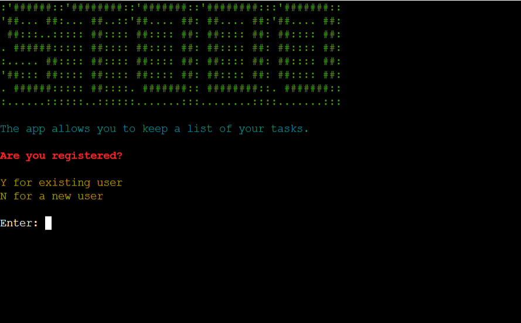
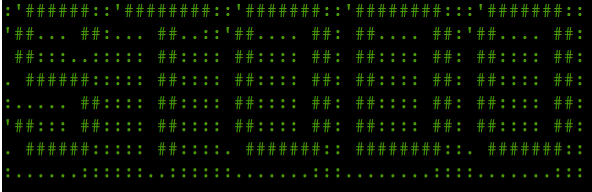
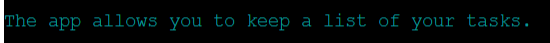
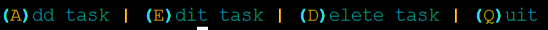
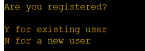
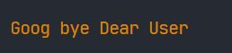
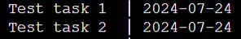

# sTODO

sTODO is a program that allows you to keep a list of your tasks. You can easily
add, edit and save your cases.

You can [visit our site here.](https://stodo-766c69891344.herokuapp.com/)

# Contents

- [sTODO](#stodo)
- [Contents](#contents)
- [User Experience (UX)](#user-experience-ux)
  - [Initial Discussion](#initial-discussion)
    - [Key Information for the Site](#key-information-for-the-site)
  - [User Stories](#user-stories)
    - [Client Goals](#client-goals)
    - [Visitor Goals](#visitor-goals)
      - [First Time Visitor Goals](#first-time-visitor-goals)
      - [Returning Visitor Goals](#returning-visitor-goals)
  - [Design](#design)
  - [Flowcharts](#flowcharts)
- [Deployment](#deployment)
  - [Github](#github)
    - [Forking the GitHub Repository](#forking-the-github-repository)
    - [Making a Local Clone](#making-a-local-clone)
  - [Heroku](#heroku)
- [Features](#features)
  - [Existing Features](#existing-features)
  - [Future Implementations](#future-implementations)
- [Technologies Used](#technologies-used)
  - [Languages Used](#languages-used)
  - [Frameworks, Libraries and Programs Used](#frameworks-libraries-and-programs-used)
  - [Credits](#credits)
    - [Code \& Content](#code--content)
    - [Media](#media)
    - [Acknowledgment](#acknowledgment)

[Back to top](#stodo)

# User Experience (UX)

## Initial Discussion

sTODO is a tool that allows a user to create a to-do list. The app is designed
to be simple and intuitive, allowing the user to add, edit and delete completed
tasks.

### Key Information for the Site

- A new user to set up a new account
- An existing user to access their account
- Functions to:
  - Add task
  - Edit task
  - Delete task

## User Stories

### Client Goals

- A simple program that users will want to use
- An program that meets the user’s needs

### Visitor Goals

#### First Time Visitor Goals

- To be able to set up a new account
- To understand how to use the app
- To be able to choose their own username and password

#### Returning Visitor Goals

- For reliable storage of personal data
- To access an existing account
- To be able to add task
- To be able to edit an existing task
- To be able to delete a task
- A pleasant user experience

[Back to top](#contents)

## Design

A rich library was used to style messages. This improves the user experience and
allows the user to pay attention to important messages. The following color
scheme was chosen:

- Green: to display logo

  

- Cyan: to display app description and user menu

  

  

- Yellow: to display questions and answer options

  

  

- Orange: to display app terminate message

  

- Red: to display error messages

  

- Magenta: to display table header

  

- Default terminal color: to display input messages, user inputs and table data

  

  

[Back to top](#contents)

## Flowcharts

- The flowcharts were created using [draw.io](https://app.diagrams.net/)

[Back to top](#contents)

# Deployment

## Github

### Forking the GitHub Repository

- By forking the GitHub Repository we make a copy of the original repository on
  our GitHub account to view and/or make changes without affecting the original
  repository by using the following steps
- Log in to GitHub and locate the GitHub Repository
- At the top of the Repository (not top of page) just above the "Settings"
  Button on the menu, locate the "Fork" Button.
- You should now have a copy of the original repository in your GitHub account.

### Making a Local Clone

- Log in to GitHub and locate the GitHub Repository
- Under the repository name, click "Clone or download".
- To clone the repository using HTTPS, under "Clone with HTTPS", copy the link.
- Open Git Bash
- Change the current working directory to the location where you want the cloned
  directory to be made
- Type git clone, and then paste the URL you copied in Step 3.
  - $ git clone <https://github.com/YOUR-USERNAME/YOUR-REPOSITORY>
- Press Enter. Your local clone will be created.

[Back to top](#contents)

## Heroku

This site is deployed using Heroku and following these steps:

1. Create a [Heroku](https://id.heroku.com/login) account or, if you already
   have one, sign in
2. Click the 'new' button and select 'create new app'
3. Enter a unique name for your app and choose the region you are in
4. Click 'create app'
5. Click 'settings' and scroll down to 'Config Vars'. Click 'reveal Config Vars'
6. In the box with the text 'KEY' type PORT and 8000 in the box with the text
   'VALUE'
7. Scroll to the next section, build packs and click 'add build pack'. Add
   Python and NodeJS, in that order. Click 'Add Build pack'
8. Scroll back to the top of the page and click 'Deploy'
9. Scroll to the Deployment method and choose Github
10. In the next section, Connect to Github, type in your repository name. If you
    press the search button it'll bring up all your repositories. Connect to the
    correct repository
11. Scroll down to the two sections for deployment (automatic deploys or manual
    deploys). The automatic deploys will update each time the 'git push' command
    is entered. For the manual deploy, this will deploy the branch specified, in
    it's current state, when the 'Deploy Branch' button is clicked.

[Back to top](#contents)

# Features

## Existing Features

## Future Implementations

[Back to top](#contents)

# Technologies Used

## Languages Used

This app was written in Python.

## Frameworks, Libraries and Programs Used

- VSCODE – To write the code
- Github - To save and store files
- Heroku - To deploy and run the live project
- Draw.io - to produce the flowcharts
- PEP8 - to validate the Python code, improving the readability and consistency

The Python libraries used are:

- gspread - an API for Google Sheets
- google.oauth2.service_account - allows the program to access data held in
  Google Sheets
- time - allows dates and times to be manipulated, use the sleep function to
  delay the page clearing and use for generate id.
- rich - to display the text in different colours
- maskpass - to display the inputted passwords as #
- os - to clear the page on the live program
- sys - used in the function to slowly print text to the screen
- hashlib - to store the password, in Google Sheets, encrypted

## Credits

### Code & Content

- [Stack overflow](https://www.stackoverflow.com/),
  [MDN Web Docs](https://developer.mozilla.org/en-US/),
  [W3 Schools](https://www.w3schools.com/),
  [LogRocket](https://blog.logrocket.com/)

  Help in solving problems. Help in implementing best practices. Search for the
  best practices. Good documentation.

- [Figma](https://www.figma.com/design/fDlsHwelyuOVsfUmCzm3dA/%D0%A1%D1%83%D1%87%D0%B0%D1%81%D0%BD%D1%8F-%D0%BF%D0%B5%D0%BA%D0%B0%D1%80%D0%BD%D1%8F?node-id=0-1&t=VeNx8IUKIo2EOdRB-0)

  Figma as a search platform for inspiration and as a graphic editor.

- Love running project from [Code Institute](https://codeinstitute.net/ie/)

  I was inspired by the Gallery page and some of the code for the site's gallery
  was taken.

- [UIVerse](https://uiverse.io/)

  credits for hover effect over images and other effects for elements goes to

- [LogRocket](https://blog.logrocket.com/responsive-image-gallery-css-flexbox/)

  credits for gallery goes from

- [Google Maps](https://www.google.ie/maps/)

  Was used to show the location

- [ZelL Liev](https://medium.com/free-code-camp/how-to-check-if-an-input-is-empty-with-css-1a83715f9f3e)

  A piece of code to implement form validation using CSS and regular
  expressions.

- [freeformatter.com](https://www.freeformatter.com/css-minifier.html#before-output)

  It was used to minimize css

- [W3C Markup Validator](https://validator.w3.org/)

  This service was used to validate HTML files

- [W3C CSS Validator](https://jigsaw.w3.org/css-validator/)

  This service was used to validate CSS files

- [JavaScript Info](https://javascript.info/)

  There is a lot of js documentation on this site

- [Google](https://google.com)

  Search engine to find information

- [ChatGPT](https://chatgpt.com/)

  As a good helper in finding information

[Back to top](#contents)

### Media

- [Unsplash](https://unsplash.com/) and [Pexels](https://www.pexels.com/)

  Images on the site are taken from these resources.

- [app-logo](https://app.logo.com/)

  the resource is used to generate an idea and automatically create a logo for
  the site

- [MDN Web Docs](https://developer.mozilla.org/en-US/)

  Instructions on how to connect the favicon to the site have been taken.

- [FlatIcon](https://www.flaticon.com/)

  The icon for the site was found on this resource.

- [Squoosh](https://squoosh.app/)

  The service was used to optimize pictures

- [FLATICON](https://www.flaticon.com/free-icon/numerology_9288700?term=dice&page=1&position=59&origin=search&related_id=9288700)

  Site favicon

[Back to top](#contents)

### Acknowledgment

- I want to thank my tutor [Marko Tot](https://github.com/tmarkec) for his daily
  care and help. For the desire to create a favorable atmosphere for learning
  and creativity.
- I would like to thank my mentor, Anthony Ugwu, for his helpful advice on
  writing the project.
- I would also like to thank the entire
  [Code Institute](https://codeinstitute.net/ie/) and
  [Kerry College](https://kerrycollege.ie/) for giving me the opportunity to
  study and participate in this project.

[Back to top](#contents)
