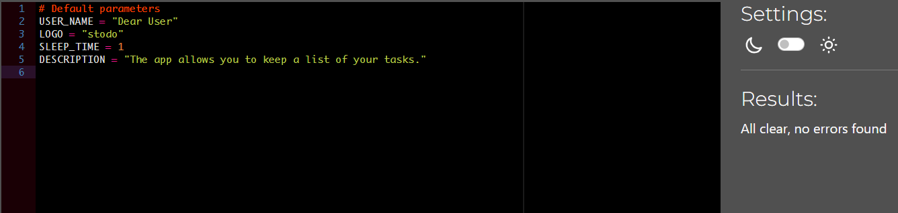

# Testing

## Contents

- [Testing](#testing)
  - [Contents](#contents)
  - [PEP8 Validator](#pep8-validator)
  - [Manual Testing](#manual-testing)
    - [Testing User Stories](#testing-user-stories)
      - [Client Goals](#client-goals)
      - [First Time Visitor Goals](#first-time-visitor-goals)
      - [Returning Visitor Goals](#returning-visitor-goals)
  - [Maunal Testing](#maunal-testing)
  - [Full Testing](#full-testing)
    - [Landing Page](#landing-page)

## PEP8 Validator

The code has been verified using a
[Code Institute Python Linter](https://pep8ci.herokuapp.com/) validator.

Results:

- run

- ui

- utils

- gsheets

- config

[Back to top](#contents)

## Manual Testing

### Testing User Stories

#### Client Goals

|                 **Goal**                 |                                                                  **How is this Achieved?**                                                                  |
| :--------------------------------------: | :---------------------------------------------------------------------------------------------------------------------------------------------------------: |
| A simple app that users will want to use | The program is intuitive and guides the user through each step of use. It is a simple program and the colors used for the fonts are interesting to the user |
|    An app that meets the user’s needs    |                                   The app allows the user to add new tasks so as not to forget to complete them on time.                                    |

[Back to top](#contents)

#### First Time Visitor Goals

|                       **Goal**                       |                                               **How is this Achieved?**                                                |
| :--------------------------------------------------: | :--------------------------------------------------------------------------------------------------------------------: |
|          To be able to set up a new account          |         The user selects N or n on the welcome page. Then performs actions to create a new user in the system.         |
|         To understand how to use the program         |                       The app accompanies the user at every step, is simple and intuitive to use                       |
| To be able to choose their own username and password | The user can choose his own login if the wig is not already used by another user. The user can also invent a password. |

[Back to top](#contents)

#### Returning Visitor Goals

|               **Goal**                |                                                    **How is this Achieved?**                                                    |
| :-----------------------------------: | :-----------------------------------------------------------------------------------------------------------------------------: |
| For reliable storage of personal data |                         Hashlib was used to encrypt user passwords before being stored in Google Sheets                         |
|     To access an existing account     | The welcome menu asks the user if they are a new user or an existing user. The user enters Y or y to access an existing account |
|        To be able to add task         |         After logging in, the user is shown a list of all his tasks. The user can also add a new one through the menu.          |
|  To be able to edit an existing task  |                              After logging in, the user can use the menu to edit an existing task.                              |
|      To be able to delete a task      |                             After logging in, the user can use the menu to delete an existing task.                             |
|      A pleasant user experience       |                                              It is a simple and intuitive program                                               |

[Back to top](#contents)

## Maunal Testing

I testing the program in:

- Google Chrome
- Microsoft Edge
- Firefox

There were no concerns in any of these browsers

[Back to top](#testing)

## Full Testing

### Landing Page

|       **Test**        |                                   **Expected Outcome**                                   | **Test Keyed** | **As Expected?** | **Pass?** |
| :-------------------: | :--------------------------------------------------------------------------------------: | :------------: | :--------------: | :-------: |
|     The letter N      |                              Asks user to choose a username                              |       N        |       Yes        |    Yes    |
|     The letter n      |                              Asks user to choose a username                              |       n        |       Yes        |    Yes    |
|     The letter Y      |                            Asks user to enter their password                             |       Y        |       Yes        |    Yes    |
|     The letter y      |                            Asks user to enter their password                             |       y        |       Yes        |    Yes    |
|   Any other letter    | Tells the user they didn't enter the correct value and asks them to choose either N or Y |       Z        |       Yes        |    Yes    |
|   Any other number    | Tells the user they didn't enter the correct value and asks them to choose either N or Y |       1        |       Yes        |    Yes    |
| Any special character | Tells the user they didn't enter the correct value and asks them to choose either N or Y |       !        |       Yes        |    Yes    |

[Back to top](#testing)
